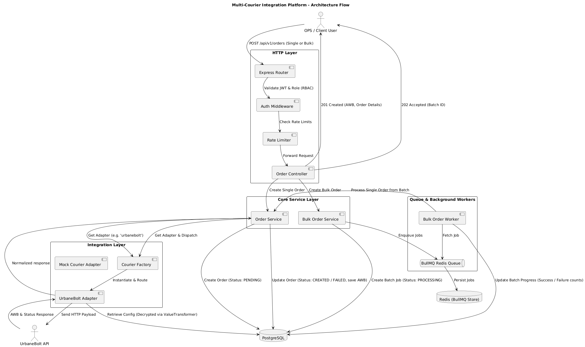
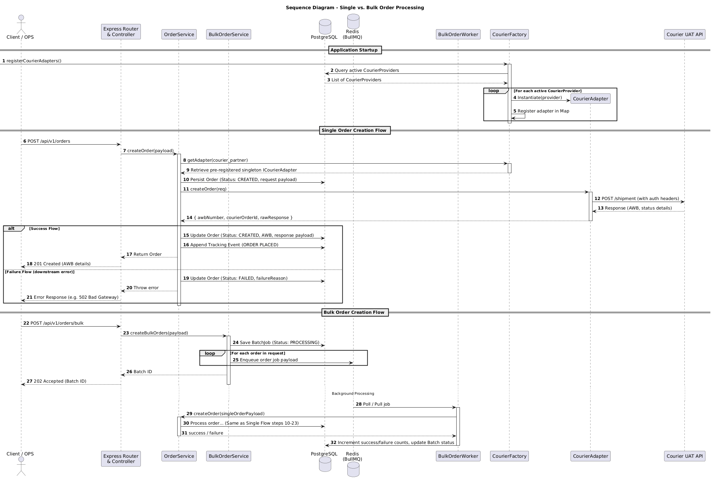

# Design Document — Multi-Courier Integration Platform

## 1. Problem Statement

An e-commerce logistics backend must integrate with multiple courier partners (UrbaneBolt today, Delhivery/Shiprocket/Bluedart tomorrow). Each courier has a different API shape, authentication method, and error vocabulary. The platform must:

- Abstract all courier differences behind a single, uniform REST API
- Support high-concurrency bulk order processing without blocking the HTTP thread
- Guarantee idempotency — no duplicate shipments even under retry storms
- Track every operation with full auditability (who created, who cancelled, when, why)
- Be extensible — adding a new courier must require **zero** changes to business logic

---

## 2. Architecture Overview

### 2.1 Architecture Flow


### 2.2 Order Creation Sequence (Single vs. Bulk)


### 2.3 Component Design Layout


```
┌──────────────────────────────────────────────────────────────┐
│                        HTTP Layer                            │
│  helmet + CORS + JSON body parser                            │
│  RequestContext (AsyncLocalStorage) — seeds requestId        │
│  Rate Limiter (Redis-backed): global 100/15min, auth 10/15m  │
└──────────────────────┬───────────────────────────────────────┘
                       │
┌──────────────────────▼───────────────────────────────────────┐
│                   Auth Middleware                             │
│  jwtAuthMiddleware → verifies Bearer token, attaches req.user│
│  rbac(...roles)    → role-based access control               │
└──────────────────────┬───────────────────────────────────────┘
                       │
┌──────────────────────▼───────────────────────────────────────┐
│               Order / Batch Controllers                       │
│  Thin layer: Zod parse → service call → normalize response   │
└──────────────────────┬───────────────────────────────────────┘
                       │
┌──────────────────────▼───────────────────────────────────────┐
│                    Order Service                              │
│  Idempotency check → CourierFactory.getAdapter() →           │
│  adapter.createOrder() → DB persist → TrackingEvent append   │
└────────────┬──────────────────────────┬──────────────────────┘
             │                          │
┌────────────▼──────────┐   ┌───────────▼──────────────────────┐
│    CourierFactory      │   │        BulkOrderService           │
│  (Strategy + Factory)  │   │  Validate all → enqueue valid     │
│  getAdapter(code)      │   │  to BullMQ → return batch_id     │
└────────────┬──────────┘   └───────────┬──────────────────────┘
             │                          │
┌────────────▼──────────┐   ┌───────────▼──────────────────────┐
│  ICourierAdapter       │   │      BulkOrderWorker (BullMQ)     │
│  ┌─ UrbaneBolt ──────┐ │   │  concurrency=10, processes jobs  │
│  │  TokenManager     │ │   │  updates BatchJob.results[]      │
│  │  HTTP client      │ │   └──────────────────────────────────┘
│  └───────────────────┘ │
│  ┌─ MockCourier ─────┐ │
│  └───────────────────┘ │
└───────────────────────┘
```

---

## 3. Key Design Decisions

### 3.1 Strategy + Factory Pattern for Couriers

**Problem:** Each courier has a different API, auth method, and payload shape.

**Solution:** Every courier implements `ICourierAdapter`:
```typescript
interface ICourierAdapter {
  createOrder(req: CreateOrderRequest): Promise<{ courierOrderId, awbNumber, rawResponse }>
  trackOrder(awbNumber: string):        Promise<{ currentStatus, events, rawResponse }>
  cancelOrder(awbNumber: string):       Promise<{ success, rawResponse }>
}
```

`CourierFactory.getAdapter(code)` resolves the adapter at runtime. Adding a new courier = **one new class + one switch case + one DB row**. Zero changes to controllers, services, or routes.

---

### 3.2 DB-Driven Courier Configuration & Encrypted Configs

All per-courier configuration lives in the `courier_providers` table:

| Column | Purpose |
|--------|---------|
| `code` | Unique string code identifying the courier partner (e.g. `urbanebolt`, `mock`) |
| `display_name` | User-friendly name of the courier partner |
| `is_active` | Boolean flag indicating whether the courier is active and registered |
| `base_url` | API base URL for shipment endpoints |
| `courier_config` | Encrypted flat string (`iv:tag:ciphertext`) representing JSON credentials and auth properties |
| `timeout_ms` | Per-request timeout |
| `max_retries` | Number of retry attempts on network/downstream failure |
| `retry_backoff_ms` | Initial exponential backoff delay |
| `retry_backoff_multiplier` | Exponential backoff multiplier |
| `max_backoff_ms` | Backoff ceiling ceiling limit |

#### Transparent Config Encryption
The `courier_config` column is a `jsonb` column in PostgreSQL, but is secured at the application layer using a TypeORM `ValueTransformer` (`credentialsTransformer`). 
* **Write (Serialization)**: Raw configuration objects (including auth endpoints, credentials, and parameters) are automatically encrypted using **AES-256-GCM** and stored as a colon-delimited string (`iv:tag:ciphertext`).
* **Read (Deserialization)**: The value is automatically decrypted into a raw JSON object containing authentication properties like `authType`, `authCredentials`, and partner-specific parameters (e.g. `customerCode` for `urbanebolt`), allowing the application logic to treat it as clean configuration objects.

This means courier credentials and configuration settings (e.g. updating API keys, URLs, or retries) can be adjusted securely without requiring code deployments.

---

### 3.3 Atomic Idempotency via DB UNIQUE Constraint

The `orders.external_order_id` column has a `UNIQUE` index. On duplicate:
1. Our service layer does an optimistic check first → returns clean `409 DUPLICATE_ORDER`
2. Even if two concurrent requests race through, the DB constraint is the ultimate safety net — only one `INSERT` succeeds

This is safer than application-level locking because it works across multiple app instances.

---

### 3.4 Pre-Failure Order Persistence

On `createOrder`, the order is saved to DB with `status=CREATED` **before** calling the courier API. This means:
- If the courier call fails → order has `status=FAILED` with `failureReason` stored for debugging
- If the app crashes mid-call → order record exists and can be reconciled
- Audit trail is never lost

---

### 3.5 RequestContext via AsyncLocalStorage

Every incoming request seeds an `AsyncLocalStorage` store with:
```typescript
{ requestId, userId, userRole, orderId, courierPartner }
```

The Winston logger reads this store on **every** log call — no need to pass IDs down through every function signature. The assignment requirement _"every failure must log order_id and courier_partner"_ is satisfied automatically.

---

### 3.6 Bulk Order Processing (Fire-and-Forget)

```
POST /api/v1/orders/bulk
  → Zod-validate ALL orders synchronously
  → Invalid orders: immediate results in response (INVALID status)
  → Valid orders: enqueued to BullMQ, return 202 + batch_id
  → Worker processes concurrently (default: 10 parallel)
  → Client polls GET /api/v1/batches/:batch_id for status
```

**Why BullMQ?**
- Processes up to 1000s of orders without blocking HTTP thread
- Built-in retry with exponential backoff per job
- Redis persistence — jobs survive app restarts
- BullMQ `jobId` = `batchId:orderId` prevents duplicate job enqueue

**Crash Recovery & Stalled Jobs:**
- **Redis Persistence:** Ensures that enqueued jobs are never lost in memory if the application process crashes or restarts.
- **Stalled Job Detection:** BullMQ automatically monitors active jobs. If a worker process terminates abruptly, the job will be flagged as stalled and automatically moved back to the wait queue to be picked up by a restarted worker.
- **Idempotency Safeguard:** Since the order creation workflow enforces a DB-level uniqueness constraint on `external_order_id` and checks this before invoking the courier API, any re-attempted batch job will safely ignore already-processed orders and only process those that had not yet succeeded, preventing double-manifestation.

---

### 3.7 JWT Authentication + RBAC

| Token | Lifetime | Storage |
|-------|----------|---------|
| Access token | 15 min (configurable) | Client memory / Authorization header |
| Refresh token | 7 days (configurable) | DB (`refresh_tokens` table, hashed with bcrypt) |

**Security choices:**
- Refresh tokens are **hashed** in DB (bcrypt) — a DB breach doesn't expose live tokens
- Login response uses generic `INVALID_CREDENTIALS` — no email enumeration
- `jwtAuthMiddleware` enriches `RequestContext` with `userId` + `userRole`

**Role matrix:**

| Endpoint | ADMIN | OPS | CLIENT |
|----------|-------|-----|--------|
| Register | ✅ | ❌ | ❌ |
| Create order | ✅ | ✅ | ✅ |
| Track order | ✅ | ✅ | ✅ |
| Cancel order | ✅ | ✅ | ❌ |
| Bulk orders | ✅ | ✅ | ❌ |
| Batch status | ✅ | ✅ | ❌ |
| Get orders by partner | ✅ | ✅ | ✅ (Own only) |

---

### 3.8 Rate Limiting (DDoS / Brute-force Protection)

Three layers, all backed by Redis (survives restarts, works across multiple instances):

| Limiter | Route | Limit |
|---------|-------|-------|
| Global | All `/api/*` | 100 req / 15 min / IP |
| Auth | `POST /auth/login`, `POST /auth/refresh` | 10 req / 15 min / IP |
| Register | `POST /auth/register` | 5 req / 1 hour / IP |
| Courier | All `/orders/*` and `/batches/*` | 60 req / 1 min / IP |

All 429 responses use the same normalized error shape as all other errors.

---

### 3.9 UrbaneBolt Token Management

The `UrbaneBoltTokenManager` keeps a single token in memory with a 55-minute TTL (tokens expire at 60 min — conservative buffer):

- **Proactive**: `getToken()` checks cache before making any API call
- **Reactive**: Axios interceptor catches 401, calls `refreshToken()`, retries once
- **Concurrent-safe**: Multiple simultaneous 401s share a single `refreshPromise` — only one HTTP call goes to the auth endpoint

---

## 4. Database Schema

```
users ←─────────────── refresh_tokens
  │                          
  │ (created_by)        
  ▼                     
orders ─────────────── tracking_events (append-only)
  │                     
  │ (batch_id)          
  ▼                     
batch_jobs              
                        
courier_providers ◄─── orders (via courier_partner code)
```

All tables use `UUID` primary keys (`gen_random_uuid()`). All timestamps are `TIMESTAMPTZ`.

---

## 5. Error Response Shape

Every error response — validation, auth, courier, rate limit, 500 — uses one shape:

```json
{
  "success": false,
  "error": {
    "code":       "COURIER_UNAVAILABLE",
    "message":    "Courier service unavailable after 3 retries",
    "details":    null,
    "request_id": "550e8400-e29b-41d4-a716-446655440000",
    "timestamp":  "2025-01-15T10:30:00.000Z"
  }
}
```

Raw courier responses are **never** forwarded to the client — they are stored in `orders.courier_response_payload` for internal debugging only.

---

## 6. Production Readiness Checklist

| Feature | Implementation |
|---------|---------------|
| Structured logging | Winston JSON format with context injection |
| Log rotation | `winston-daily-rotate-file` (14d combined, 30d errors) |
| Distributed rate limiting | Redis-backed `rate-limit-redis` |
| Security headers | `helmet` middleware |
| Idempotency | DB-level UNIQUE constraint + optimistic check |
| Graceful shutdown | SIGTERM/SIGINT → close HTTP → stop worker → close DB → quit Redis |
| Health check | `GET /health` (unauthenticated, used by Docker HEALTHCHECK) |
| Retry + backoff | Configurable per courier in DB, exponential with ceiling |
| Audit trail | `created_by`, `cancelled_by` on every order |
| Token security | Bcrypt-hashed refresh tokens in DB |

---

## 7. Future Scalability & Feature Roadmap

### 7.1 Scaling to Handle High Request Volumes

To scale the platform to handle a significantly larger volume of requests in the future, we would adopt the following architecture:

1. **Fully Asynchronous Order Ingestion**:
   - Currently, single orders (`POST /api/v1/orders`) are processed synchronously. To handle high request rates, we would make **all** order creation requests asynchronous (fire-and-forget). The HTTP server would immediately return a `202 Accepted` status with an order tracking ID, placing the payload in a high-throughput queue.
2. **Message Queue & Broker Scaling**:
   - Transition from BullMQ (Redis-backed) to **Apache Kafka** or **AWS Kinesis** for high-throughput event streaming.
   - Separate the application into lightweight, stateless **Ingestion API Nodes** and dedicated **Worker Microservices** running in isolated containerized environments (Kubernetes/ECS) that scale independently based on queue depth.
3. **Database Scalability (PostgreSQL)**:
   - **Connection Pooling**: Implement **PgBouncer** or **AWS RDS Proxy** to manage PostgreSQL connection spikes.
   - **Read-Write Splitting**: Route all state mutations (writes) to the primary database node, while distributing track queries (`GET /orders/:id/track`) and analytics reads to multiple read replicas.
   - **Table Partitioning**: Partition the `orders` and `tracking_events` tables by time (e.g. monthly partitions) to keep index sizes small and queries fast as data grows to tens of millions of records.
4. **Caching Strategy**:
   - Implement query caching in Redis for tracking endpoints. Since shipment tracking updates occur periodically, caching tracking queries for 1–2 minutes significantly reduces read traffic on the database.

### 7.2 Email Verification & Status Notifications

To support email verification on signup and order status updates, we design the following asynchronous notification flow:

#### 1. Registration Email Verification
* **Signup Flow**: When a new user registers (`POST /api/v1/auth/register`), the user record is initialized with `is_verified = false`.
* **Token Generation**: Generate a cryptographically secure, short-lived verification token (stored in Redis with a 24-hour expiration).
* **Asynchronous Notification**: Publish a `user.registered` event to the message broker. A dedicated **Notification Worker** picks up the event and sends a verification link via third-party APIs (e.g. Amazon SES, SendGrid, Mailgun).
* **Verification Endpoint**: The user clicks the link, invoking `POST /api/v1/auth/verify-email?token=<token>` to validate the token in Redis and mark `is_verified = true`.

#### 2. Order Status Update Notifications
* **State Updates**: Whenever an order status changes (e.g. `PICKED_UP`, `IN_TRANSIT`, `DELIVERED`, `CANCELLED`), the `OrderService` publishes an `order.status_changed` event.
* **Notification Worker**: The worker consumes the event, retrieves the customer's contact information (email/SMS), maps the status to a localized notification template (e.g. "Your package is out for delivery!"), and dispatches the notification via email (SendGrid) or SMS (Twilio).
* **Reliability**: Running notifications through a separate background queue ensures that third-party provider downtime or slow APIs do not block our core logistics platform or fail the shipment status transitions.
